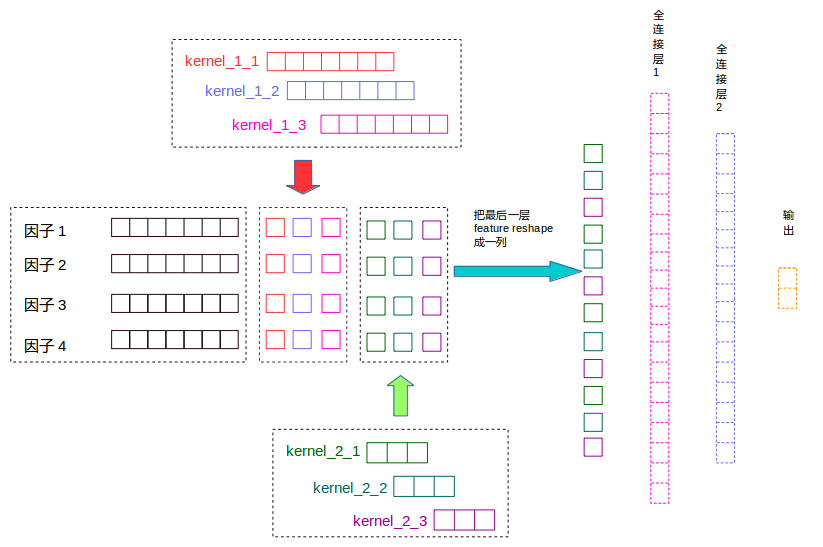
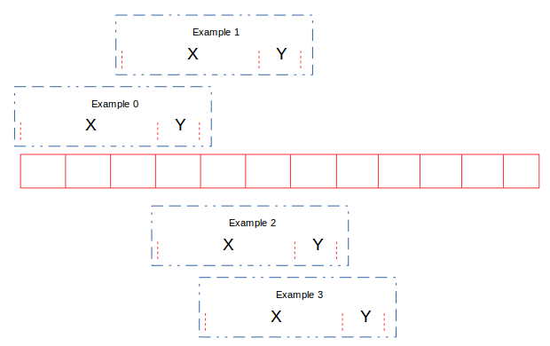
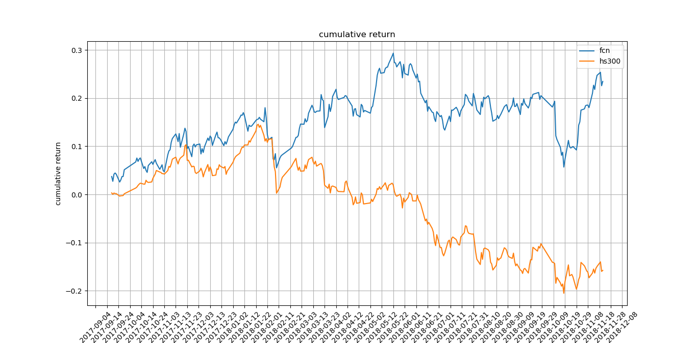
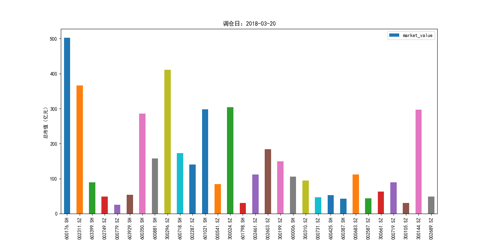
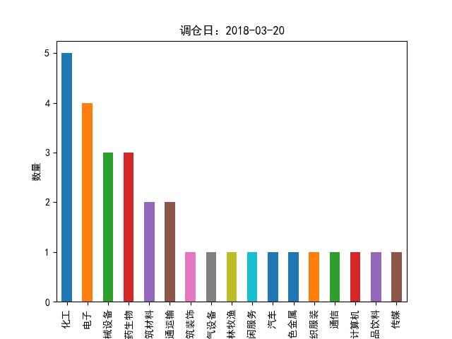
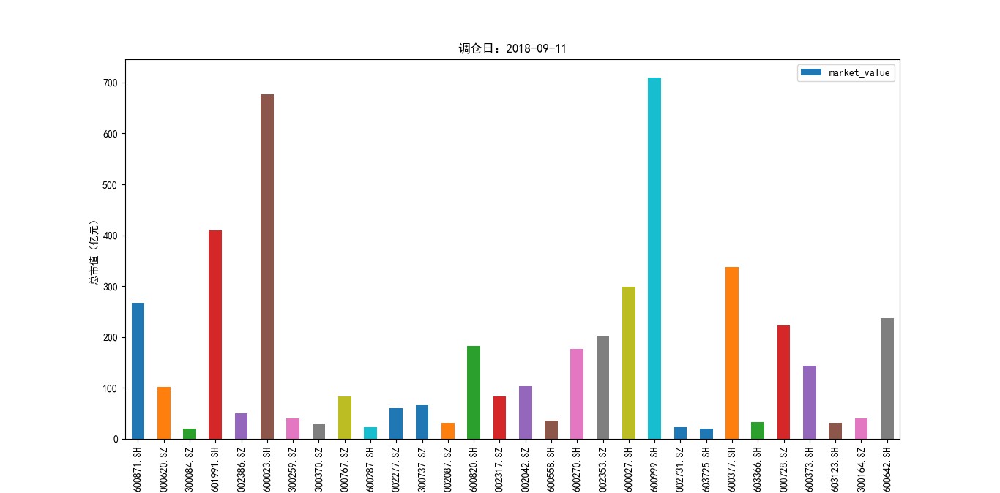
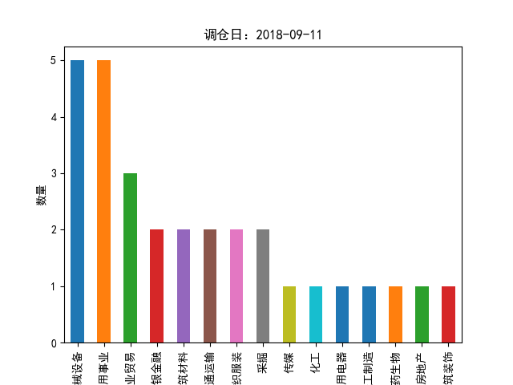

# 第二阶段任务总结及成果分析展示

### 这一阶段工作主要内容

1. 因子梳理，编码，计算

   ​	本次梳理了6大类19小类，总计385个股票因子；2大类总计18个指数与行业因子，并对这些因子进行了编码，因子类别以A-Z编码，因子编号以3位0-9数字编码．完成计算的股票因子总计172个．具体详情参照附件[quant_factors.pdf][1]

2. 新模型设计

   ​	本次采用的模型是自己设计的单因子卷积神经网络，具体模型原理和建模过程下面会详细说到．

3. 回测

   ​	利用单因子卷积神经网络的预测结果进行回测，回测时间范围2017-09-18至2018-11-21，下面会详细说一下训练回测数据划分规则．本次参与训练的因子共有29个，并没有将所有的因子参与训练．

4. 第一阶段成果集群部署

   ​	完成代码迁移，但是还没进行调优．

### 内容介绍

#### 本次梳理的因子

#### 模型介绍

##### 模型介绍

​	模型的原理来源于日常选股判断，人们在决定下一期要买哪些股票时，一般都会回看一段时间的历史数据，这些历史数据包含价格数据，财务数据，技术指标数据等等，但是从这些历史时间序列数据中发现对未来股票涨跌有影响价值的特征并不是所有人都能挖掘出来的，本次的模型就是采用这个原理，利用卷积强大的特征提取能力对各种历史因子序列数据进行特征提取，以此来预估未来股票的涨跌情况．

​	模型结构如下图所示：

##### 建模流程

1. 数据获取

   * 股票池：全A股（理论上应该剔除ST股票，截面期下一交易日停牌的股票以及上市未满3个月的股票，但是没有相关数据）

   * 数据范围：2005-01-04至2018-11-21（沪深300从2005-01-04才开始有交易数据，所以数据只能从2005-01-04开始选取）

   * 因子数据：这次实验只用了29个因子，具体因子如下：

     | 因子类别       | 因子名称                                | 因子编码 |
     | -------------- | --------------------------------------- | -------- |
     | 估值因子       | 市盈率PE（TTM）                         | AB001    |
     |                | 市净率PB（TTM，调整后净资产）           | AB003    |
     |                | 市现率PCF（TTM，经营现金流量）          | AB005    |
     | 风险因子       | 20日收益方差                            | AC001    |
     |                | 个股收益的20日峰度                      | AC004    |
     |                | 20日正收益方差                          | AC007    |
     |                | 20日损失方差                            | AC010    |
     |                | 20日收益损失方差比                      | AC013    |
     | 超买超卖类因子 | 过去5日的价格动量                       | AFA001   |
     |                | 过去10日的价格动量                      | AFA002   |
     |                | 过去1个月的日收益率的最大值             | AFA007   |
     |                | LN（最近一个月最高价/最近一个月最低价） | AFA008   |
     |                | 当前股价/过去1个月股价均值-1            | AFA009   |
     |                | 过去5日的价格动量-过去1个月的价格动量   | AFA012   |
     |                | 过去20日股价偏度                        | AFA016   |
     | 成交量因子     | 5日平均换手率                           | AFB001   |
     |                | 10日平均换手率                          | AFB002   |
     |                | 6日成交金额的移动平均值                 | AFB012   |
     |                | 20日成交金额的移动平均值                | AFB013   |
     |                | 6日成交金额的标准差                     | AFB014   |
     |                | 20日成交金额的标准差                    | AFB015   |
     | 量价因子       | 资金流量指标                            | AFC001   |
     |                | 威廉变异离散量（WVAD）6日均值           | AFC003   |
     | 能量型因子     | AR人气指标                              | AFD001   |
     |                | BR意愿指标                              | AFD002   |
     |                | CR能量指标                              | AFD003   |
     | 趋势型因子     | Arron-Up                                | AFE001   |
     |                | Arron-Down                              | AFE002   |
     |                | Arron-Osc                               | AFE003   |

     ​	这些因子都是随便选的，这些因子相对来说计算后的缺失值较少，之所以没有选用财务类指标，是因为财务类指标三个月才更新一次，当前模型不适用财务指标类因子，后期会更改模型结构，使其适用所有因子．

2. 数据预处理

   * 中位数去极值：设第 T 期某因子在所有个股上的暴露度序列为$$D_{i}$$ ，$$D_M$$为该序列中位数，$$D_{M1}$$ 为序列$$|D_i-D_M|$$的中位数，则将序列$$D_i$$中所有大于$$D_M+5D_{M1}$$的数重设为$$D_M+5D_{M1}$$ ，将序列$$D_i$$中所有小于$$D_M-5D_{M1}$$的数重设为$$D_M-5D_{M1}$$；（这里的T期在这次模型中就是某个交易日，因子暴露度就是因子值）
   * 缺失值处理：得到新的因子暴露度序列后，将因子暴露度缺失的地方设为申万一级行业相同个股的平均值。
   * 行业市值中性化：将填充缺失值后的因子暴露度对行业哑变量（0,1变量，即股票属于该行业为1，不属于为0）和取对数后的市值做线性回归，取残差作为新的因子暴露度。
   * 标准化：将中性化处理后的因子暴露度序列减去其现在的均值、除以其标准差，得到一个新的近似服从N(0,1)分布的序列。

3. 训练集测试集划分

   ​	从2005-01-04至2018-11-21总计3375个交易日，按30个交易日进行划分，总计划分了113个交易月．

    * 模型输入数据制作

      ​	模型输入总计29个因子，每个因子取3个交易月（即90个交易日）的因子数据作为模型输入，模型输入实际上就是一个29*90的矩阵．（这样选择的原理是通过观察90个交易日的数据，预测未来一个月的股票涨跌情况）．

    * 标签（模型输出）制作

      ​	模型输出总共两类，1代表正类，0代表负类．正类负类的划分规则如下：

      ​	计算3个交易月后的1个交易月各个股票的累计收益率，减去沪深300这个月的累计收益率，按超额收益率从高到低进行排序，取前30％的股票作为正类，后30％的股票作为负类，其余的股票和这些股票的因子数据丢弃不使用．

      数据制作好后，按一个交易月进行滚动，提取模型的$$X_{29*90}$$和Y，数据提取过程如下图所示：

      

   总计提取了110个example，0\~99作为Train，100~109用作Test（也即回测的区间）．

4. 训练

   ​	模型总共两层卷积，每个卷积后在跟一个正则化层，卷积层后跟两个全连接层，最后再接输出层．具体训练参数如下：

    * 输入：29*90的矩阵，代表29个因子90个交易日的数据．
    * 第一层卷积：64个卷积核，卷积核尺寸90*1，每次向下移动步长为1，即一个因子一个因子进行卷积提取特征，可以对29个因子提取64个feature map.
    * 第二层卷积：64个卷积核，卷积核尺寸64*1（因为上一层卷积输出是29\*64），每次向下移动步长为1，即对上层卷积输出的每个因子的64\*1特征进行卷积再次提取深层特征．
    * 第一层全连接：384个神经元
    * 第二层全连接：192个神经元
    * 输出：2个神经元

#### 回测

​	利用训练得到的模型对100\~109的example进行预测，对预测为正类的股票的概率值降序排序，取前30只股票构成下个交易月的资产组合，由于制作数据时是按月滚动，所以调仓间隔就是30个交易日．

#### 回测结果

##### 累计收益率

##### 资产组合市值行业分布

1. 第一次调仓

   

   

2. 第二次调仓

   

   

3. 第三次调仓

   

   

4. 第四次调仓

   

   

5. 第五次调仓

   

   

6. 第六次调仓

   

   

7. 第七次调仓

   

   

8. 第八次调仓

   

9. 

10. 第九次调仓

    

    

11. 第十次调仓

    

    

----

### 附件

[1]: boloomo_factors.pdf
